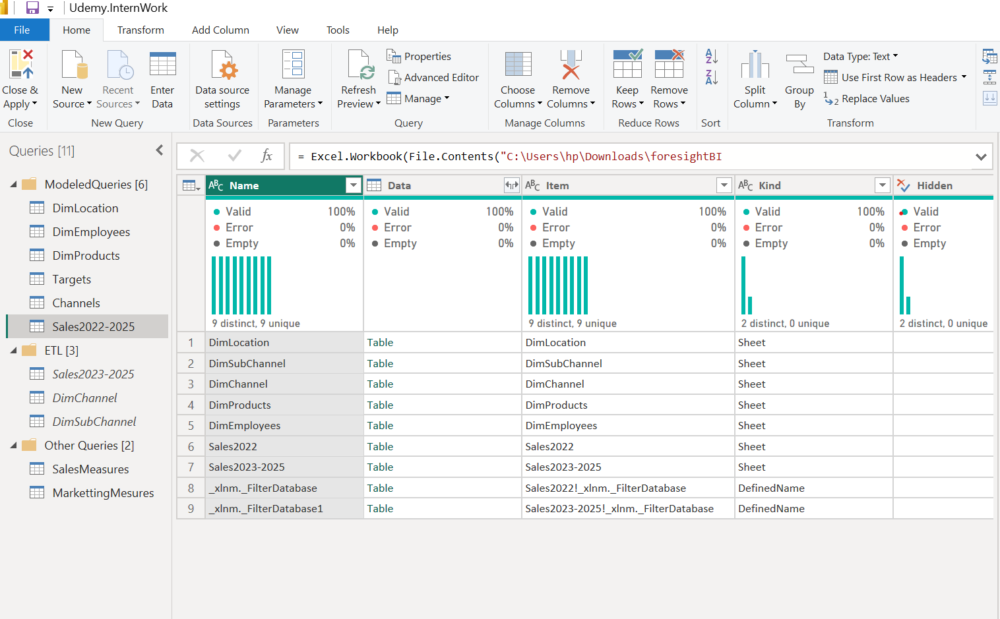
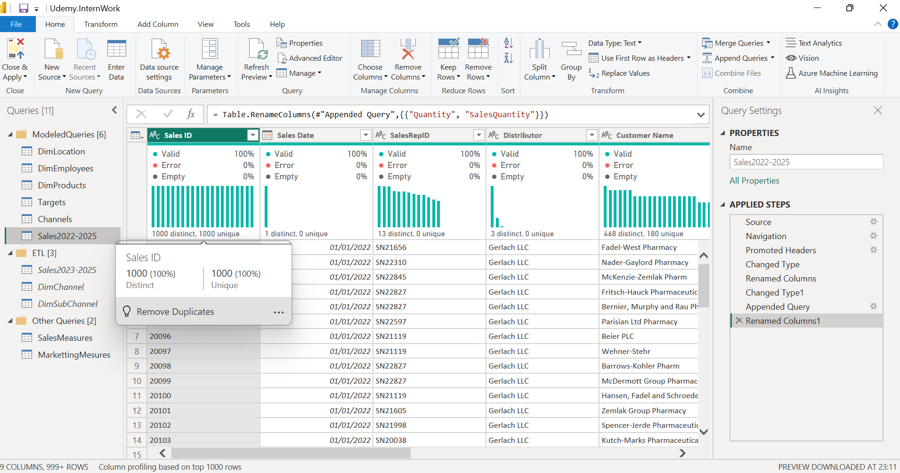
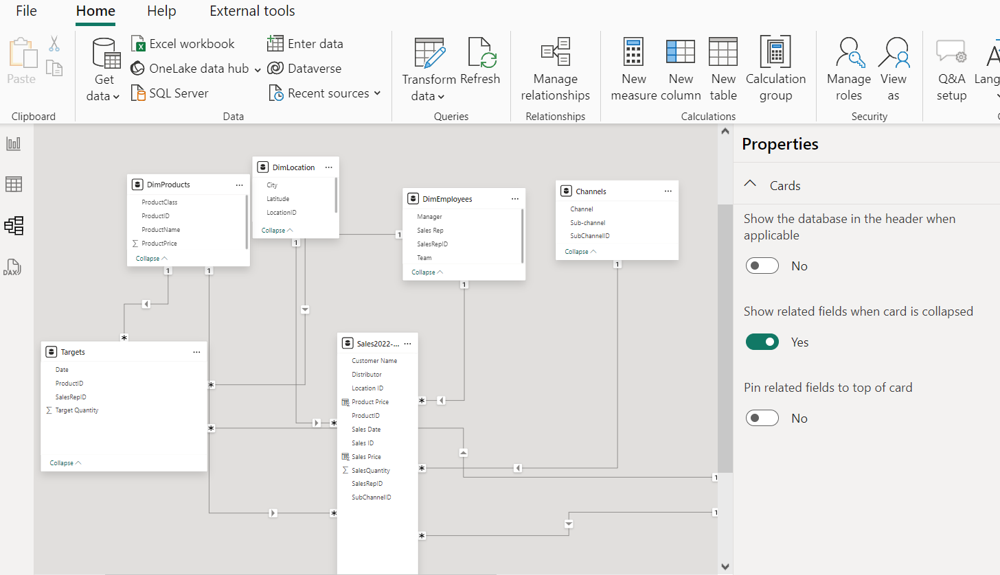
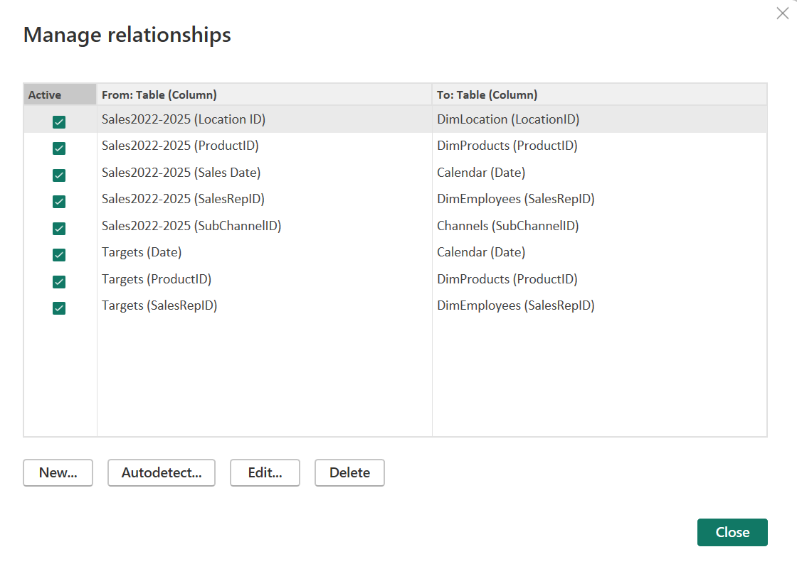
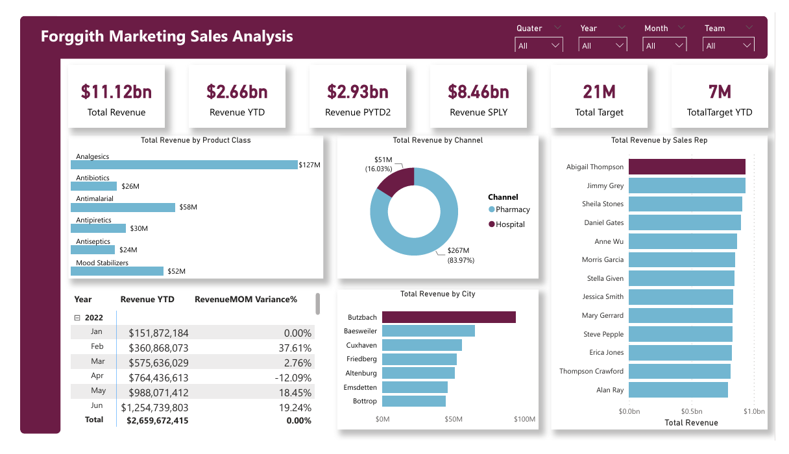
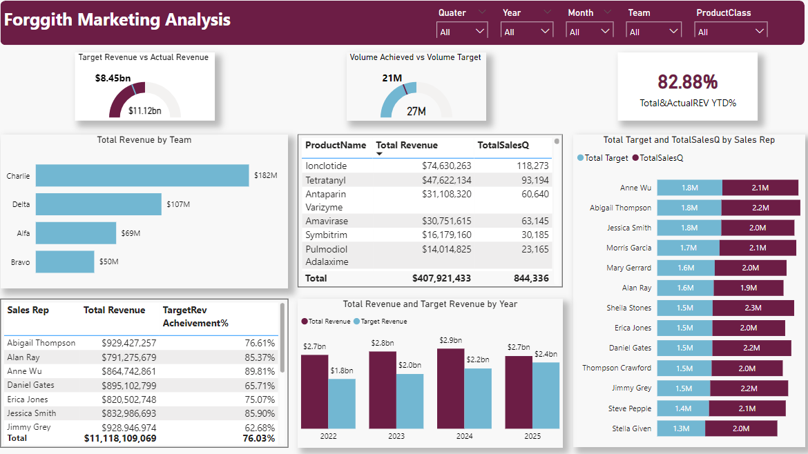

# Forggith Pharmaceutical Sales and Marketting Analysis

## Introduction
This is a Power BI project.

Forggith Pharmaceuticals (Forggith) is a Pharmaceutical Manufacturing company based in Germany. As a Manufacturing company, they produce medical drugs which get to the consumers through their Distributors.

Forggith provided a template for their distributors to capture records of their sales which are then sent to Forggith on a monthly basis. This data is then used for reporting and analysis by Forggith to achieve their goals Sales and Marketing objectives through tracking and monitoring of KPIs.

**_Disclaimer_**: All datasets and reports are simply for demonstration purposes and do not represent any actual or real life company. Datasets used in the project was provided by and is available on [Foresight Bi](https://training.foresightbi.com.ng/courses/take/power-bi-developer-internship/texts/45012192-introduction-to-the-program)
## Problem Statement
Forggith is looking to create some Power BI Reports to assist in guiding their strategies, tactics and operations as a company. For a start, they have identified a couple of numbers they will like to report from their data as reports:

-  Total  Revenue
-  Total Revenue Year To Date (YTD)
-  Total Revenue Previous Year YTD
-  Total Revenue Same Period Last Year(SPLY)
-  Total Target
-  Total TargetYTD
-  Actual Revenue Performance YTD vs Target YTD
-  Revenue Month on Month Percentage Change and more...

## Here are ideas of how these reports will be used:
The Sales Representative can track their performances through-out the periods to plan their marketing activities.
The Team Managers can track their teams' performances through-out the periods to plan their teams' activities.
Executive team can track Revenue numbers to monitor alignment with the set targets to influence medium to long term strategies.

## Data Transformation:
The dataset was loaded into Power Query using *Excel.Workbook(File.Contents)*. This Mcode makes it possible to carry out data transformations directly on the root folder, hence performing an ETL(Extract, Transform and Load) process. When new records are added or updated, and are refreshed in Power BI Deskptop or Service, the changes will automatically be applied.
Imported Folder      |      ETL ready folder
:-------------------:| :--------------------:
 | 

## Modelling
The snowflake model was used, connecting the dimension to the Facts table seamlessly in a one to many relationship. With two Facts table, The target table and sales table. This connection made it possible for analysis like target vs actual. 
SnowflakeSchema        |      Relationship
:-------------------:  | :--------------------:
 | 

## Analysis and Visualization
A detailed analysis showed that:
1. Forggith pharmaceutical generated a total revenue of $2.87b
2. Forggith surpassed both their revenue and volume target, achieving about 6 million addional sales.
3. Based on it's distribution channel, Pharmacy generated the most revenue, attributing for 64% of the revenue compared to Hospital's 36%.
4. The year 2024 was responsible for the highest revenue generated.

Sales Analysis          |      Marketting Analysis
:-------------------------:|:----------------------:
 | 

Want to interact with the report? click [here](https://app.powerbi.com/view?r=eyJrIjoiYTE3MTZhYzAtOWVjZi00ZTE4LWI3ODktM2MzYmI2NWUxY2JlIiwidCI6ImFjN2I4NTA3LTcwNDMtNGJhNS1hZTY4LWU2MmYxNGU5NjBiYSJ9)

## Conclussion and Recommendations
It is clear that Forggith pharmaceuticals are growing based on their revenue growth. Some recommendations that is put forward include:
1. Since the pharmacy channel is responsible for the most revenue, forggith should prioritise the channel. However, it should consider carrying out promotion offer to encourage those in the hospital channel to purchase it's product more. This will drive higher revenue.
2. Sales teams performing well, consistently, should be rewarded, in form of a bonus(or other alternative) to appreciate them, encourage them to do more and also push less performing teams to do better.
3. Since different product class perform differntly per city, when target quantites are not met by such city, more marketing and promotion offers should be carried out in such cities, while cities that meet up with the target, can be given special vip or membership offers.
